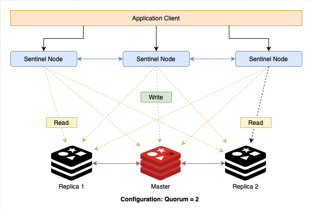

# Spring Boot Redis Sentinel Example

### Overview
Redis is an open source (BSD licensed), in-memory data structure store used as a database, cache, message broker, and streaming engine. Redis provides data structures such as strings, hashes, lists, sets, sorted sets with range queries, bitmaps, hyperloglogs, geospatial indexes, and streams. Redis has built-in replication, Lua scripting, LRU eviction, transactions, and different levels of on-disk persistence, and provides high availability via Redis Sentinel and automatic partitioning with Redis Cluster.

**Redis Sentinel** is high availability solution of redis. It provides **monitoring**, **automatic failover**, and **configuration provider**. Redis sentinel will monitor and automatically detect a master failure and bring all cluster to a stable mode. In [**this article**](https://blog.piinalpin.com/2022/10/redis-sentinel-spring-lettuce-client/) we can run redis sentinel with 1 master and 2 replicas. And we will use **3 sentinel instance**, **1 master and 2 slave**, and the usual quorum value is 2.



### Lettuce Client
To connect sentinel instances we need to use a client that also supports Sentinel itself. Lettuce is a scalable thread-safe Redis client for synchronous, asynchronous and reactive usage. Multiple threads may share one connection if they avoid blocking and transactional operations such as BLPOP and MULTI/EXEC. Lettuce is built with netty. Supports advanced Redis features such as Sentinel, Cluster, Pipelining, Auto-Reconnect and Redis data models. Lettuce client also can use connection pooling to a Redis node.

Before implement redis client using Spring Lettuce Client, please run redis sentinel cluster properly. See my [**How to Run Redis Sentinel**](https://blog.piinalpin.com/2022/10/redis-sentinel-spring-lettuce-client/) article.

### Configuration
Add *Spring Data Redis*, Spring Web and Lombok for utility to our `pom.xml`
```xml
<dependency>
  <groupId>org.springframework.boot</groupId>
  <artifactId>spring-boot-starter-data-redis</artifactId>
</dependency>
<dependency>
  <groupId>org.springframework.boot</groupId>
  <artifactId>spring-boot-starter-web</artifactId>
</dependency>

<dependency>
  <groupId>org.projectlombok</groupId>
  <artifactId>lombok</artifactId>
  <optional>true</optional>
</dependency>
```

And create properties file using `.yaml` file like following `application.yaml`
```yaml
server:
  port: 8080

spring:
  application:
    name: redis-sentinel-demo
  cache:
    type: redis
    redis:
      time-to-live: 600
  redis:
    database: 0
    sentinel:
      master: mymaster
      nodes:
        - localhost:26379
        - localhost:26380
        - localhost:26381
    lettuce:
      shutdown-timeout: 200ms
```

Create a connection configuration `RedisConfig.java` using `LettuceConnectionFactory`
```java
@Configuration
public class RedisConfig {

    private final RedisProperties redisProperties;

    @Autowired
    public RedisConfig(RedisProperties redisProperties) {
        this.redisProperties = redisProperties;
    }

    @Bean
    public CacheManager cacheManager(LettuceConnectionFactory lettuceConnectionFactory) {
        RedisCacheConfiguration redisCacheConfiguration = RedisCacheConfiguration.defaultCacheConfig()
                .disableCachingNullValues();
        return RedisCacheManager.builder(lettuceConnectionFactory)
                .cacheDefaults(redisCacheConfiguration)
                .build();
    }

    @Bean
    public LettuceConnectionFactory lettuceConnectionFactory() {
        final RedisSentinelConfiguration sentinelConfiguration = new RedisSentinelConfiguration()
                .master(redisProperties.getSentinel().getMaster());
        final LettuceClientConfiguration lettuceClientConfiguration = LettuceClientConfiguration.builder()
                .readFrom(ReadFrom.ANY_REPLICA)
                .build();

        redisProperties.getSentinel().getNodes().forEach(node -> {
            final String[] sentinelNodes = node.split(":");
            final String host = sentinelNodes[0];
            final int port = Integer.parseInt(sentinelNodes[1]);

            sentinelConfiguration.sentinel(host, port);
        });

        LettuceConnectionFactory connectionFactory = new LettuceConnectionFactory(sentinelConfiguration, lettuceClientConfiguration);
        connectionFactory.setDatabase(redisProperties.getDatabase());
        return connectionFactory;
    }

    @Bean
    public RedisTemplate<String, Object> redisTemplate() {
        final RedisTemplate<String, Object> redisTemplate = new RedisTemplate<>();
        redisTemplate.setKeySerializer(new StringRedisSerializer());
        redisTemplate.setValueSerializer(new JdkSerializationRedisSerializer());
        redisTemplate.setConnectionFactory(lettuceConnectionFactory());
        return redisTemplate;
    }

}
```

### Redis Cache Helper
To make it easier to use the `RedisTemplate<K, V>` we will create an interface helper class, namely `RedisCacheHelper` and define method for store cache, get cache, and remove cache.

```java
public interface RedisCacheHelper {

    void put(String cacheName, Object key, Object value, long ttl);

    Object get(String cacheName, Object key);

    void remove(String cacheName, Object key);

}
```

And we will create implementatins for `HashOperations<K, HK, HV>` and `ValueOperations<K, V>` for example usage.

**Hash Operations**
```java
@Slf4j
@Component(value = RedisCacheHelperHashOperations.BEAN_NAME)
public class RedisCacheHelperHashOperations implements RedisCacheHelper {

    public static final String BEAN_NAME = "redisCacheHelperHashOperations";

    @Autowired
    public RedisTemplate<String, Object> redisTemplate;

    @Override
    public void put(String cacheName, Object key, Object value, long ttl) {
        redisTemplate.opsForHash().put(cacheName, key, value);
    }

    @Override
    public Object get(String cacheName, Object key) {
        return redisTemplate.opsForHash().get(cacheName, key);
    }

    @Override
    public void remove(String cacheName, Object key) {
        redisTemplate.opsForHash().getOperations().delete(cacheName + key);
    }
}
```

**Value Operations**
```java
@Slf4j
@Component
public class RedisCacheHelperValueOperations implements RedisCacheHelper {

    public static final String BEAN_NAME = "redisCacheHelperValueOperations";
    private static final String SEPARATOR_CACHE = ":";

    @Autowired
    private RedisTemplate<String, Object> redisTemplate;

    @Override
    public void put(String cacheName, Object key, Object value, long ttl) {
        redisTemplate.opsForValue().set(constructKey(cacheName, key), value, ttl, TimeUnit.SECONDS);
    }

    @Override
    public Object get(String cacheName, Object key) {
        return redisTemplate.opsForValue().get(constructKey(cacheName, key));
    }

    @Override
    public void remove(String cacheName, Object key) {
        redisTemplate.opsForValue().getOperations().delete(constructKey(cacheName, key));
    }

    private String constructKey(String cacheName, Object key) {
        return cacheName + SEPARATOR_CACHE + key;
    }

}
```

### Service and Logic
Now we create a `POJO` class for data transfer object.
```java
@Data
@Builder
@NoArgsConstructor
@AllArgsConstructor
public class DataCacheDto implements Serializable {

    private static final long serialVersionUID = -7799415185617798522L;

    private String name;

    private String message;

}
```

And create service logic to use `RedisCacheHelper` for redis operations. Our service should look like following.
```java
@Slf4j
@Service
public class DemoService {

    @Autowired
    @Qualifier(RedisCacheHelperHashOperations.BEAN_NAME)
    private RedisCacheHelper cacheHelperHash;

    @Autowired
    @Qualifier(RedisCacheHelperValueOperations.BEAN_NAME)
    private RedisCacheHelper cacheHelperValue;

    @Value("${spring.cache.redis.time-to-live:600}")
    private Integer defaultTtl;

    private final static String DEMO = "DEMO";

    private String generateKey() {
        return UUID.randomUUID().toString().replace("-", "");
    }

    public Map<String, Object> putHash(DataCacheDto request) {
        String key = this.generateKey();
        try {
            log.info("Put data [{}] to cache by hash operations", request);
            cacheHelperHash.put(DEMO, key, request, defaultTtl);
        } catch (Exception e) {
            log.error("Got exception when put cache by hash operations", e);
            throw e;
        }
        return Map.of("key", key);
    }

    public DataCacheDto getFromHash(String key) {
        DataCacheDto cache;
        try {
            log.info("Get data from cache by hash operation. Key :: [{}]", key);
            cache = (DataCacheDto) cacheHelperHash.get(DEMO, key);
            log.info("Data cache :: {}", cache);
        } catch (Exception e) {
            log.error("Got exception when get cache by hash operations", e);
            throw e;
        }
        return cache;
    }

    public Map<String, Object> putValue(DataCacheDto request) {
        String key = this.generateKey();
        try {
            log.info("Put data [{}] to cache by value operations", request);
            cacheHelperValue.put(DEMO, key, request, defaultTtl);
        } catch (Exception e) {
            log.error("Got exception when put cache by value operations", e);
            throw e;
        }
        return Map.of("key", key);
    }

    public DataCacheDto getFromValue(String key) {
        DataCacheDto cache;
        try {
            log.info("Get data from cache by value operation. Key :: [{}]", key);
            cache = (DataCacheDto) cacheHelperValue.get(DEMO, key);
            log.info("Data cache :: {}", cache);
        } catch (Exception e) {
            log.error("Got exception when get cache by value operations", e);
            throw e;
        }
        return cache;
    }

}
```

The `@Qualifier` annotation indicates which service is used for the operation. Finally, we create a controller to test via web service.

```java
@Slf4j
@RestController
@RequestMapping(value = "")
public class DemoController {

    @Autowired
    private DemoService service;

    @PostMapping(value = "/hash-operations")
    public ResponseEntity<Map<String, Object>> storeCacheHash(@RequestBody DataCacheDto request) {
        return ResponseEntity.ok(service.putHash(request));
    }

    @GetMapping(value = "/hash-operations/{key}")
    public ResponseEntity<DataCacheDto> getCacheHash(@PathVariable String key) {
        return ResponseEntity.ok(service.getFromHash(key));
    }

    @PostMapping(value = "/value-operations")
    public ResponseEntity<Map<String, Object>> storeCacheValue(@RequestBody DataCacheDto request) {
        return ResponseEntity.ok(service.putValue(request));
    }

    @GetMapping(value = "/value-operations/{key}")
    public ResponseEntity<DataCacheDto> getCacheValue(@PathVariable String key) {
        return ResponseEntity.ok(service.getFromValue(key));
    }

}
```

### Project structure
The project structure should be look like the following content.
```text
src
├── main
│   └── java
│   │  └── com.piinalpin.redissentinel
│   │      ├── component
│   │      │  ├──impl
│   │      │  │ ├── RedisCacheHelperHashOperations.java
│   │      │  │ └── RedisCacheHelperValueOperations.java
│   │      │  └── RedisCacheHelper.java
│   │      ├── config
│   │      │  └── RedisConfig.java
│   │      ├── controller
│   │      │  └── DemoController.java
│   │      ├── dto
│   │      │  └── DataCacheDto.java
│   │      ├── service
│   │      │  └── DemoService.java
│   │      └── Application.java
│   └── resources
│   │  └── application.yaml
└── test
    └── java
       └── com.piinalpin.redissentinel
```

### Run and Test Application
Run spring boot application and test with postman or with cUrl. I will provide cUrl command at the following.

**Store by Hash Operation**
```bash
curl -X POST \
  'http://localhost:8080/hash-operations' \
  --header 'Accept: */*' \
  --header 'Content-Type: application/json' \
  --data-raw '{
  "name": "maverick",
  "message": "Hello World!"
}'
```

**Get by Hash Operation**
```bash
curl -X GET \
  'http://localhost:8080/hash-operations/71783f6348654baf9c844e4363d8e5f7' \
  --header 'Accept: */*''
```

**Store by Value Operation**
```bash
curl -X POST \
  'http://localhost:8080/value-operations' \
  --header 'Accept: */*' \
  --header 'Content-Type: application/json' \
  --data-raw '{
  "name": "maverick",
  "message": "Hello World!"
}'
```

**Get by Value Operation**
```bash
curl -X GET \
  'http://localhost:8080/value-operations/71783f6348654baf9c844e4363d8e5f7' \
  --header 'Accept: */*''
```

### Run as Container
Before we run from container, create `Dockerfile`, `docker-compose.yaml` and `application-docker.yaml` file to used for application container configuration.

**Dockerfile**

The `Dockerfile` is used for build docker images.

```Dockerfile
# Import base JDK from Linux
FROM adoptopenjdk/openjdk11:alpine

# Set work directory
WORKDIR /app

# Copy application files
COPY application-docker.yaml application.yaml
COPY target/*.jar app.jar

# Expose PORT
EXPOSE 8080

# Run application
ENTRYPOINT ["java", "-jar", "app.jar", "--spring.config.location=application.yaml"]
```

**Docker Compose File**

The `docker-compose.yaml` file is used for defining multiple container. And we will run 4 container such as :
- Redis Master with Sentinel Mode
- Redis Replica 1 with Sentinel Mode
- Redis Replica 2 with Sentinel Mode
- Spring Boot Application

```yaml
version: "3.8"

services:
  redis-master:
    hostname: redis-master.mylab.local
    container_name: redis-master
    image: redis:7.0.5
    command: >
      bash -c "echo 'port 26379' > sentinel.conf &&
      echo 'dir /tmp' >> sentinel.conf &&
      echo 'sentinel resolve-hostnames yes' >> sentinel.conf &&
      echo 'sentinel monitor mymaster redis-master.mylab.local 6379 2' >> sentinel.conf &&
      echo 'sentinel down-after-milliseconds mymaster 5000' >> sentinel.conf &&
      echo 'sentinel parallel-syncs mymaster 1' >> sentinel.conf &&
      echo 'sentinel failover-timeout mymaster 5000' >> sentinel.conf &&
      cat sentinel.conf &&
      redis-server sentinel.conf --sentinel & 
      redis-server --maxmemory 256mb --maxmemory-policy allkeys-lru"
    volumes:
      - "redis-bitnami-data:/bitnami/redis/data"
      - "redis-data:/data"

  redis-slave-1:
    hostname: redis-slave-1.mylab.local
    container_name: redis-slave-1
    image: redis:7.0.5
    command: >
      bash -c "echo 'port 26379' > sentinel.conf &&
      echo 'dir /tmp' >> sentinel.conf &&
      echo 'sentinel resolve-hostnames yes' >> sentinel.conf &&
      echo 'sentinel monitor mymaster redis-master.mylab.local 6379 2' >> sentinel.conf &&
      echo 'sentinel down-after-milliseconds mymaster 5000' >> sentinel.conf &&
      echo 'sentinel parallel-syncs mymaster 1' >> sentinel.conf &&
      echo 'sentinel failover-timeout mymaster 5000' >> sentinel.conf &&
      cat sentinel.conf &&
      redis-server sentinel.conf --sentinel & 
      redis-server --port 6380 --slaveof redis-master.mylab.local 6379 --maxmemory 256mb --maxmemory-policy allkeys-lru"
    volumes:
      - "redis-bitnami-data:/bitnami/redis/data"
      - "redis-data:/data"

  redis-slave-2:
    hostname: redis-slave-2.mylab.local
    container_name: redis-slave-2
    image: redis:7.0.5
    command: >
      bash -c "echo 'port 26379' > sentinel.conf &&
      echo 'dir /tmp' >> sentinel.conf &&
      echo 'sentinel resolve-hostnames yes' >> sentinel.conf &&
      echo 'sentinel monitor mymaster redis-master.mylab.local 6379 2' >> sentinel.conf &&
      echo 'sentinel down-after-milliseconds mymaster 5000' >> sentinel.conf &&
      echo 'sentinel parallel-syncs mymaster 1' >> sentinel.conf &&
      echo 'sentinel failover-timeout mymaster 5000' >> sentinel.conf &&
      cat sentinel.conf &&
      redis-server sentinel.conf --sentinel & 
      redis-server --port 6381 --slaveof redis-master.mylab.local 6379 --maxmemory 256mb --maxmemory-policy allkeys-lru"
    volumes:
      - "redis-bitnami-data:/bitnami/redis/data"
      - "redis-data:/data"

  application:
    hostname: redis-sentinel-demo
    container_name: redis-sentinel-demo-app
    image: piinalpin/redis-sentinel-demo:0.0.1-SNAPSHOT
    build:
      context: .
    ports:
      - "8080:8080"
networks:
  default:
    driver: bridge

volumes:
  redis-data:
  redis-bitnami-data:
```

**Application Properties Configuration**

The properties configuration file must setup sentinel node to internal network docker container. That why, the `docker-compose.yaml` defined `hostname` and the application will read sentinel nodes by hostname.

```yaml
server:
  port: 8080

spring:
  application:
    name: redis-sentinel-demo
  cache:
    type: redis
    redis:
      time-to-live: 600
  redis:
    database: 0
    sentinel:
      master: mymaster
      nodes:
        - redis-master.mylab.local:26379
        - redis-slave-1.mylab.local:26379
        - redis-slave-2.mylab.local:26379
    lettuce:
      shutdown-timeout: 200ms
```

**Build the Application**

Before we run the container, we must build package our application.
```bash
mvn clean package -Dmaven.test.skip=true
```

And finally we can run the container application by typing the `docker compose` command.
```bash
docker compose up -d --build
```

And shutdown the container by typing command `docker compose down -v`

### Reference
- [High Availability with Redis Sentinel and Spring Lettuce Client](https://medium.com/trendyol-tech/high-availability-with-redis-sentinel-and-spring-lettuce-client-9da40525fc82)
- [Redis — Using master node to save and replicas nodes to read with Springboot.](https://filipemunhoz.medium.com/redis-using-master-node-to-save-and-replicas-nodes-to-read-with-springboot-b86a0dbb3baf)
- [How to use **cacheDefaults** method](https://www.tabnine.com/code/java/methods/org.springframework.data.redis.cache.RedisCacheManager$RedisCacheManagerBuilder/cacheDefaults)
- [Spring Boot Caching with Redis Sentinel always connects to master node](https://stackoverflow.com/questions/64809960/spring-boot-caching-with-redis-sentinel-always-connects-to-master-node)
- [Class ReadFrom - Lettuce Docs](https://lettuce.io/core/release/api/io/lettuce/core/ReadFrom.html)
- [Lettuce - Advanced Java Redis client](https://github.com/lettuce-io/lettuce-core)